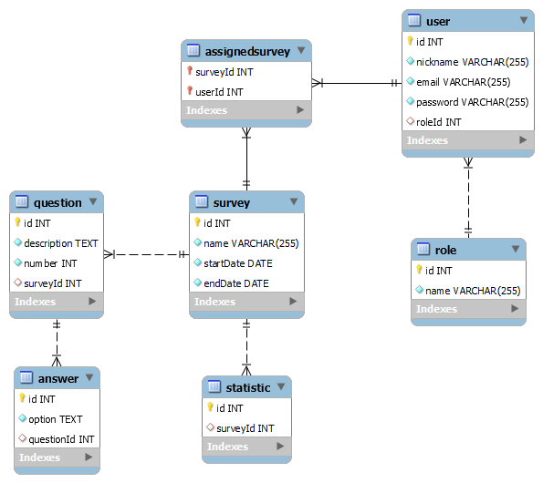

# Проєктування бази даних

## Модель бізнес-об'єктів

@startuml

entity Role
entity Role.id
entity Role.name

entity User
entity User.id
entity User.nickname
entity User.email
entity User.password
entity User.roleId

entity Survey
entity Survey.id
entity Survey.name
entity Survey.startDate
entity Survey.endDate

entity AssignedSurvey
entity AssignedSurvey.surveyId
entity AssignedSurvey.userId

entity Question
entity Question.id
entity Question.description
entity Question.number
entity Question.survey

entity Answer
entity Answer.id
entity Answer.option
entity Answer.questionId

entity Statistic
entity Statistic.id
entity Statistic.surveyId

Role.id --r-* Role
Role.name --r-* Role

User.id --u-* User
User.nickname --u-* User
User.password --u-* User
User.email --u-* User
User.roleId --u-* User

Survey.id --d-* Survey
Survey.name --d-* Survey
Survey.startDate --d-* Survey
Survey.endDate --d-* Survey

AssignedSurvey.surveyId --d-* AssignedSurvey
AssignedSurvey.userId --d-* AssignedSurvey

Question.id --d-* Question
Question.description --d-* Question
Question.number --d-* Question
Question.survey --d-* Question

Answer.id --u-* Answer
Answer.option --u-* Answer
Answer.questionId --u-* Answer

Statistic.id --u-* Statistic
Statistic.surveyId --u-* Statistic

User "0,*" -l- "1" Role
Survey "0,*" -- "1" User
Survey "1" -l- "1,3" Question
Survey "1" -r- "0,*" AssignedSurvey
Question "1,3" -- "1" Answer
Survey "1" -- "1" Statistic

@enduml

@startuml

!theme plain
top to bottom direction
skinparam linetype ortho

class Answer {
- option: String
- id: Long
- question: Question
  }
  class AssignedSurvey {
- surveyId: Long
- survey: Survey
- user: User
- userId: Long
  }
  class Question {
- survey: Survey
- id: Long
- answer: Answer
- number: Long
- description: String
  }
  class Role {
- id: Long
- name: String
  }
  class Statistic {
- id: Long
- survey: Survey
  }
  class Survey {
- id: Long
- questions: List<Question>
- name: String
- endDate: Date
- startDate: Date
  }
  class User {
- nickname: String
- email: String
- id: Long
- password: String
- roleId: Role
  }

Answer         "1" *-[#595959,plain]-> "question\n1" Question       
AssignedSurvey "1" *-[#595959,plain]-> "survey\n1" Survey         
AssignedSurvey "1" *-[#595959,plain]-> "user\n1" User           
Question       "1" *-[#595959,plain]-> "answer\n1" Answer         
Question       "1" *-[#595959,plain]-> "survey\n1" Survey         
Statistic      "1" *-[#595959,plain]-> "survey\n1" Survey         
Survey         "1" *-[#595959,plain]-> "questions\n*" Question       
User           "1" *-[#595959,plain]-> "roleId\n1" Role           
@enduml

## Реляційна схема

